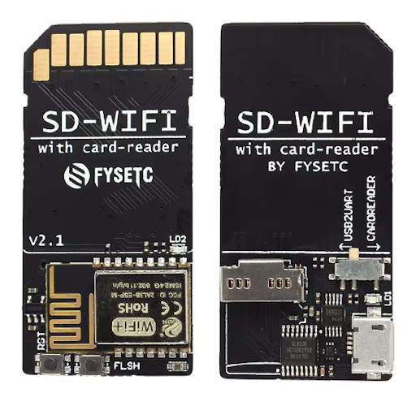
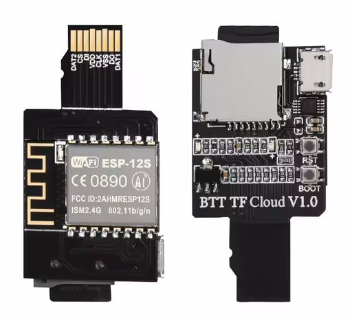
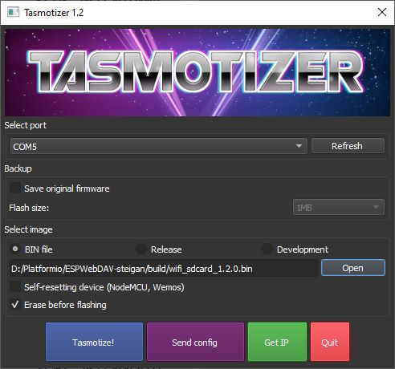
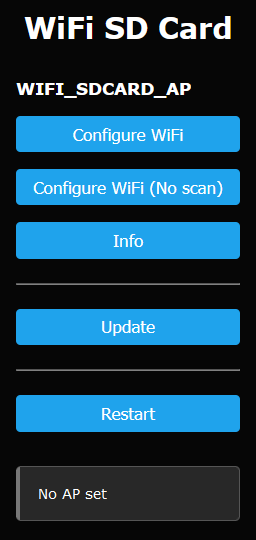
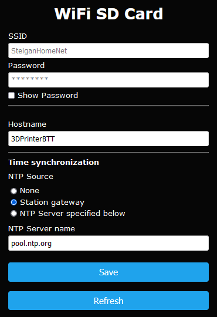

[EN](README.MD) | [RU](README_RU.MD)
# Alternative firmware for FYSETC SD-WIFI and BIGTREETECH BTT TF/SD Cloud modules
> [!NOTE]
> Based on [FYSETC/ESPWebDAV](https://github.com/FYSETC/ESPWebDAV) [version 1.1.1](https://github.com/FYSETC/ESPWebDAV/releases/tag/v1.1.1) firmware. Original [README](README_ORI.MD).
> 
> Key differences from the original:
> * Espressif8266 platform has been updated (tested on espressif8266 @ 4.2.1).
> * Added [WiFiManager](https://github.com/tzapu/WiFiManager):
>   * Module can be configured using the Web interface via WiFi. SD card and/or UART connection are no longer used to configure the module.
>   * Credentials (WiFi SSID and password) are stored directly in the module.
>   * Additional parameters (host name, NTP settings) are stored in the EEPROM.
>   * Web portal has a firmware update functionality.
> * NTP-client is added for synchronization and correct saving of file and directory creation times in the file system.
> * Enabled mDNS for accessing the module by host name.
> * Updated library [ESP8266SdFat](https://github.com/earlephilhower/ESP8266SdFat), which supports UTF8 encoding.
> 
> Some ideas were borrowed from [AlbrechtL/BTT_TF_Cloud_AFW](https://github.com/AlbrechtL/BTT_TF_Cloud_AFW) and [propiro/BTT_TF_Cloud_AFW](https://github.com/propiro/BTT_TF_Cloud_AFW/tree/patch-1) repositories.

## Appearance of the modules
## FYSETC SD-WIFI

## BIGTREETECH BTT TF Cloud

## BIGTREETECH BTT SD Cloud

## Firmware features

* WebDAV server (`http://<module hostname or IP address>:8080`).
* Web Portal (`http://<module hostname or IP address>:80`):
  * Configuring the module.
  * Firmware update.
  * Information page.
* SPI bus control to avoid conflicts with the main device (e.g. 3D printer)*.
* Time synchronization with NTP server.
* UTF8 file name support**.
* Supports FAT16 and FAT32.
* Supports SD/TF cards up to 32GB.
>[!WARNING] * Bus busy is indicated by a continuous LED. The main device must not access the SD card while writing and reading files via WebDAV protocol!

>[!WARNING] ** In some WebDAV client applications it is necessary to enable UTF8 encoding.

> [!NOTE] Communication between the ESP8266/ESP8285 and some newer routers can be unstable. For example, my router required disabling QAM-256 mode for the module to work properly.

## Download
Firmware releases are available at the following link: https://github.com/Steigan/ESPWebDAV/releases.

## Initial installation
>[!WARNING] If you want to keep the original firmware, please take the appropriate steps yourself.

### Windows
* Download the `bin file` from the latest [release](https://github.com/Steigan/ESPWebDAV/releases).
* Download the **`Tasmotizer`** from [link](https://github.com/tasmota/tasmotizer/releases).
* Connect the module to a USB port on your computer. 
>[!WARNING] Do not insert the module into the SD slot of your computer! The switch on the FYSETC module must be set to the USB2UART position beforehand.   
* Switch the module into the firmware mode. To do this, press and hold the `BOOT`/`FLASH` button. Briefly press the `RST` reset button. The LED will blink once. Release the `BOOT`/`FLASH` button.
* Start the `Tasmotizer`:
 
 

* Specify the COM port to which the module is connected.
* Press `Open` and select the `bin file` of the firmware.
* Press `Tasmotize!` and wait for the process to finish. 
* Reboot the module by pressing the `RST` button.

### Linux
* Download the `bin file` from the latest [release](https://github.com/Steigan/ESPWebDAV/releases).
* You will need **`esptool.py`** for flashing. Details can be found at https://github.com/espressif/esptool.
* Connect the module to a USB port on your computer. 
>[!WARNING] Do not insert the module into the SD slot of your computer! The switch on the FYSETC module must be set to the USB2UART position beforehand.   
* Switch the module into the firmware mode. To do this, press and hold the `BOOT`/`FLASH` button. Briefly press the `RST` reset button. The LED will blink once. Release the `BOOT`/`FLASH` button.
* Determine which serial interface the module is connected to.
* Execute the command `esptool.py -p <port> write_flash 0x0000 <bin file>` and wait for completion.
* Reboot the module by pressing the `RST` button.

## Over-the-Air (OTA) firmware update via Web portal

The module must be installed in the main device slot or connected via USB.
* Download the `bin file` from the latest [release](https://github.com/Steigan/ESPWebDAV/releases).
* Go to the Web portal of the module in your browser to `http://<module hostname or IP>`.
* Select the `Update` menu item.
* Select the `bin file` of the firmware.
* Click `Update`.
* Reboot the module by pressing the `RST` button.

## Reset settings and credentials

The module must be installed in the main device slot or connected via USB.
* Press the `BOOT`/`FLASH` button for more than 5 seconds until the LED flashes three times.
* The module configuration is reset, you can proceed to initial setup.

## Initial setup

The module must be installed in the main device slot or connected via USB.
* At the first startup, the module creates access point `WIFI_SDCARD_AP` to which you should connect. As a result, you will be able to access the module's Web portal via the link `http://192.168.4.1/`:

* Go to the `Configure WiFi` menu:

* Enter the credentials of the WiFi network. Refine the other settings.
* Click `Save`.

## Normal module operation

### Module boot sequence and indication
* Several short LED flashes indicate initialization of the UART interface for debug information transmission.
* Continuous LED flashes indicate that the module is connected to the WiFi network.
* Repeated LED flashes indicate that WiFi is connected, the Web portal is available, and the WebDAV server is expected to start.
* The WebDAV server is started as soon as the SPI bus is free, but not earlier than 20 seconds after the module is booted. This is to avoid conflict with the host device at the time of insertion into the slot or common power supply.
* After all services have been initialized, the LED goes out.
* LED blinks indicates that data is being exchanged over the SPI bus.

## Thanks
* ardyesp for ESPWebDAV https://github.com/ardyesp/ESPWebDAV
* FYSETC for https://github.com/FYSETC/ESPWebDAV
* tzapu for https://github.com/tzapu/WiFiManager
* greiman for https://github.com/greiman/SdFat
* earlephilhower for https://github.com/earlephilhower/ESP8266SdFat
* AlbrechtL for https://github.com/AlbrechtL/BTT_TF_Cloud_AFW