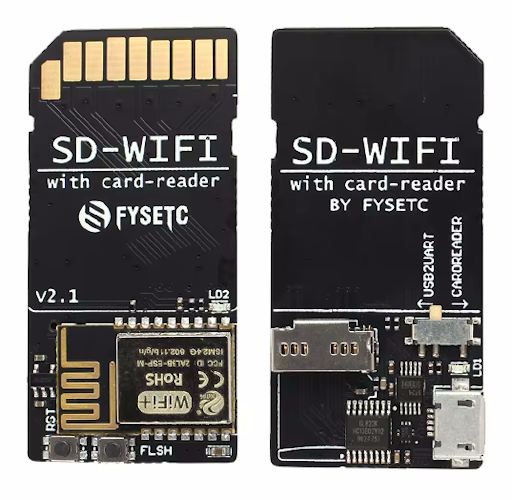
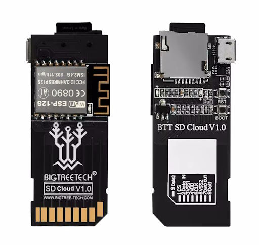
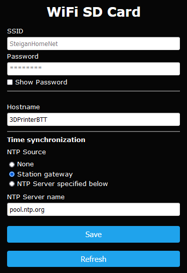

[EN](README.md) | [RU](README_RU.md)
# Альтернативная прошивка для модулей FYSETC SD-WIFI и BIGTREETECH BTT TF/SD Cloud
> [!NOTE]
> Основана на прошивке [FYSETC/ESPWebDAV](https://github.com/FYSETC/ESPWebDAV) [версии 1.1.1](https://github.com/FYSETC/ESPWebDAV/releases/tag/v1.1.1). Оригинальный [README](README_ORI.MD).
> 
> Ключевые отличия от оригинала:
> * Платформа espressif8266 обновлена до актуальной (проверено на espressif8266 @ 4.2.1).
> * Добавлен [WiFiManager](https://github.com/tzapu/WiFiManager), благодаря чему:
>   * Настройка модуля осуществляется с помощью Web-интерфейса через WiFi. SD-карта и/или подключение по UART для настройки модуля больше не используются.
>   * Учетные данные (SSID сети WiFi и пароль) сохраняются непосредственно в модуле.
>   * Дополнитеьные параметры (имя хоста, настройки NTP) сохраняются в EEPROM.
>   * Web-интерфейс модуля имеет функционал обновления прошивки.
> * Добавлен NTP-клиент для синхронизации и корректного сохранения в файловой системе времени создания файлов и каталогов.
> * Включен mDNS для доступа к модулю по имени хоста.
> * Использована обновленная библиотека [ESP8266SdFat](https://github.com/earlephilhower/ESP8266SdFat), в которой имеется поддержка кодировки UTF8.
> 
> Часть идей позаимствована из репозиториев [AlbrechtL/BTT_TF_Cloud_AFW](https://github.com/AlbrechtL/BTT_TF_Cloud_AFW) и [propiro/BTT_TF_Cloud_AFW](https://github.com/propiro/BTT_TF_Cloud_AFW/tree/patch-1)

## Внешний вид модулей
## FYSETC SD-WIFI

## BIGTREETECH BTT TF Cloud

## BIGTREETECH BTT SD Cloud

## Функционал прошивки

* Сервер WebDAV (`http://<имя хоста или IP модуля>:8080`).
* Web портал (`http://<имя хоста или IP модуля>:80`):
  * Конфигурирование модуля.
  * Обновление прошивки.
  * Информационная страница.
* Контроль шины SPI во избежание конфликтов с основным устройством (например, 3D принтером)*.
* Синхронизация времени с NTP сервером.
* Поддержка имен файлов в кодировке UTF8**.
* Поддержка FAT16 и FAT32.
* Поддержка SD/TF карт до 32 ГБ.

> [!WARNING]
>  \* О том что шина занята сигнализирует светодиод непрерывным свечением. Непосредственно во время записи и чтения файлов по протоколу WebDAV основное устройство не должно обращаться к SD карте!

> [!WARNING]
> \** В некоторых клиентских приложениях WebDAV необходимо включить принудительное использование кодировки UTF8.

> [!NOTE]
> Связь между ESP8266/ESP8285 и некоторыми более современными роутерами может быть нестабильной. Например, в моем роутере потребовалось отключить режим QAM-256 для нормальной работы модуля.

## Загрузка
Релизы прошивки доступны по ссылке: https://github.com/Steigan/ESPWebDAV/releases

## Первоначальная установка
> [!WARNING]
> Если необходимо сохранить исходную прошивку, примите для этого соответсвующие меры самостоятельно.

### Windows
* Скачайте `файл bin` из последнего [релиза](https://github.com/Steigan/ESPWebDAV/releases).
* Скачайте программу **`Tasmotizer`** по [ссылке](https://github.com/tasmota/tasmotizer/releases).
* Подключите модуль к USB порту компьютера. 
> [!WARNING]
> Не вставляйте модуль в SD слот компьютера! Переключатель на модуле FYSETC предварительно необходимо перевести в положение USB2UART.   
* Переведите модуль в режим прошивки. Для этого нажмите и удерживайте кнопку `BOOT`/`FLASH`. Кратковременно нажмите кнопку сброса `RST`. Светодиод мигнет один раз. Отпустите кнопку `BOOT`/`FLASH`.
* Запустите `Tasmotizer`:
 
 

* Укажите COM порт, к которому подключился модуль.
* Нажмите `Open` и выберите `bin-файл` прошивки.
* Нажмите `Tasmotize!`, дождитесь окочания процесса. 
* Перезагрузите модуль нажатием кнопки `RST`.

### Linux
* Скачайте `файл bin` из последнего [релиза](https://github.com/Steigan/ESPWebDAV/releases).
* Для прошивки понадобится **`esptool.py`**. Более подробно можно ознакомиться по ссылке https://github.com/espressif/esptool.
* Подключите модуль к USB порту компьютера. 
> [!WARNING]
> Не вставляйте модуль в SD слот компьютера! Переключатель на модуле FYSETC предварительно необходимо перевести в положение USB2UART.   
* Переведите модуль в режим прошивки. Для этого нажмите и удерживайте кнопку `BOOT`/`FLASH`. Кратковременно нажмите кнопку сброса `RST`. Светодиод мигнет один раз. Отпустите кнопку `BOOT`/`FLASH`.
* Определите к какому последовательному интерфейсу подключился модуль.
* Выполните команду `esptool.py -p <порт> write_flash 0x0000 <файл bin>` и дождитесь завершения.
* Перезагрузите модуль нажатием кнопки `RST`.

## Обновление прошивки Over-the-Air (OTA) посредством Web портала

Модуль должен быть установлен в слот основного устройства либо подключен через USB.
* Скачайте `файл bin.gz` из последнего [релиза](https://github.com/Steigan/ESPWebDAV/releases).
* Перейдите в браузере на Web портал модуля по ссылке `http://<имя хоста или IP модуля>`.
* Выберите пункт меню `Update`.
* Выберите `файл bin.gz` прошивки (поддерживается перетаскивание).
* Нажмите `Update`.
* Перезагрузите модуль нажатием кнопки `RST`.

## Сброс настроек и учетных данных

Модуль должен быть установлен в слот основного устройства либо подключен через USB.
* Нажмите кнопку `BOOT`/`FLASH` и удерживайте ее более 5 секунд до появления трёх вспышек светодиода.
* Конфигурация модуля сброшена, можно перейти к первоначальной настройке.

## Первоначальная настройка

Модуль должен быть установлен в слот основного устройства либо подключен через USB.
* При первом запуске модуль создает точку доступа `WIFI_SDCARD_AP`, к которой необходимо подключиться. В результате появится доступ к Web порталу модуля по ссылке `http://192.168.4.1/`:

* Перейдите в меню `Configure WiFi`:

* Внесите учетные данные сети WiFi. Уточните остальные настройки.
* Нажмите `Save`.

## Нормальная работа модуля

### Последовательность загрузки модуля и индикация
* Несколько коротких вспышек светодиода сигнализируют об инициализации UART интерфейса для передачи отладочной информации.
* Непрерывное свечение светодиода означает, что модуль подключается к сети WiFi.
* Повторяющиеся вспышки светодиода сигнализируют о том, что WiFi подключен, доступен Web портал, ожидается запуск сервера WebDAV.
* Сервер WebDAV запускается как только шина SPI будет свободна, но не раньше чем через 20 секунд с момента загрузки модуля. Это необходимо для избежания конфликта с основным устройством в момент установки в слот или подачи общего питания.
* После инициализации всех сервисов светодиод гаснет.
* Загорающийся светодиод сигнализирует о том, что по шине SPI происходит обмен данными.

## Благодарности
* ardyesp за ESPWebDAV https://github.com/ardyesp/ESPWebDAV
* FYSETC за https://github.com/FYSETC/ESPWebDAV
* tzapu за https://github.com/tzapu/WiFiManager
* greiman за https://github.com/greiman/SdFat
* earlephilhower за https://github.com/earlephilhower/ESP8266SdFat
* AlbrechtL за https://github.com/AlbrechtL/BTT_TF_Cloud_AFW